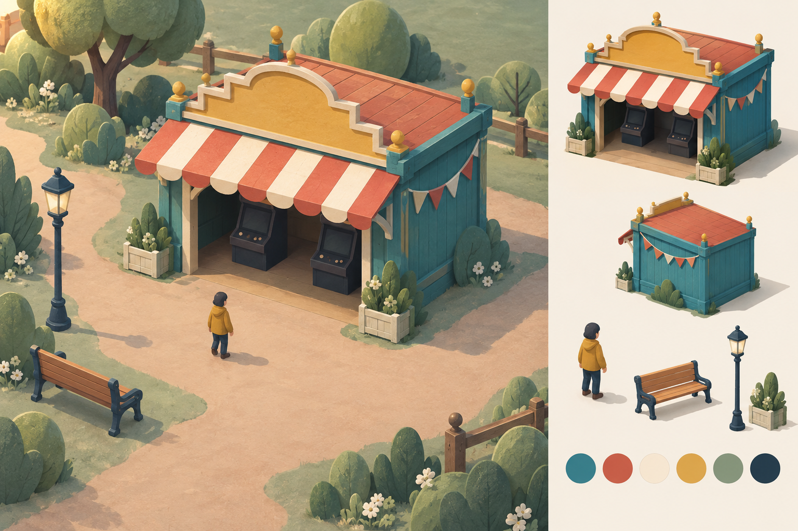

# Arcade direction — approval draft

Generated with the built-in image-generation tool. This is a concept sheet, not a runtime texture, production sprite sheet, or authoritative map. The original is preserved outside the repository; this copy belongs to the project.

## Review

The broad pavilion silhouette, teal timber, coral/cream awning, mustard marquee, and open doorway establish the proposed visual language. The small visitor and isolated prop studies help assess scale and consistency.

Before production, simplify the fine foliage and wood grain for readability at actual game scale. Match the player to the existing collision footprint rather than copying the illustrated proportions literally. The extra rear view is a reference, not an additional runtime asset commitment.

The paths, fences, and plants are illustrative dressing only: they are not approved changes to the functional map. The existing arcade approach crosses walkable grass, and the central landmark bypass must remain clear. Production assets need separate transparent exports, explicit anchors, and collision-independent placement; do not slice this composition into runtime artwork. All critical signage remains live text.

## Approval gate

The user approved this visual direction on 2026-09-11: “Yes—use this direction”. Production work may proceed, preserving the functional-map constraints and simplifying detail as described above.

## Generation prompt

Use case: stylized-concept. Asset type: landscape game art-direction concept sheet for Little Demos phase 4, approval draft, NOT a runtime flattened map. Create a beautifully composed handcrafted miniature fairground concept, matte painted timber and stitched canvas, softly rounded cut-paper vegetation, crisp broad silhouettes with restrained tactile grain. Main left two-thirds: elevated front three-quarter view of one small arcade pavilion and its generous approach path. Teal body #31777a, coral #bb4d42 and cream #f8f4e9 scalloped striped awning, mustard yellow #e5b74c stepped marquee with BLANK sign face, wide unobstructed south/front opening with two simple dark arcade cabinet silhouettes inside. Small mustard-jacket visitor on open path in front, clear feet and dark trousers, character about one quarter doorway height. Quiet sage #6d9a83 ground, clay #d8b8a0 paths, navy #173449 line/shadow accents. Warm upper-left daylight, short down-right shadows. On right one-third: neatly spaced isolated views of that same pavilion, player, one bench, one lamp, planter, and six unlabeled palette swatches, consistent camera angle/materials. Main scene ground extends to the image edges, no diorama plinth/rim, no desk, no UI cards. Functional constraints: arcade is a broad 300-by-190 footprint viewed from south, south doorway, open horizontal route continues to right, no props across doorway or route. This is near-isometric visual mood only, not a rotated map specification. No text or labels anywhere, no watermark, no logos, no neon, no photorealism, no microdetail, no clutter, no night lighting, no grand attractions competing with arcade. Landscape composition with clear negative space, cohesive game concept sheet.
