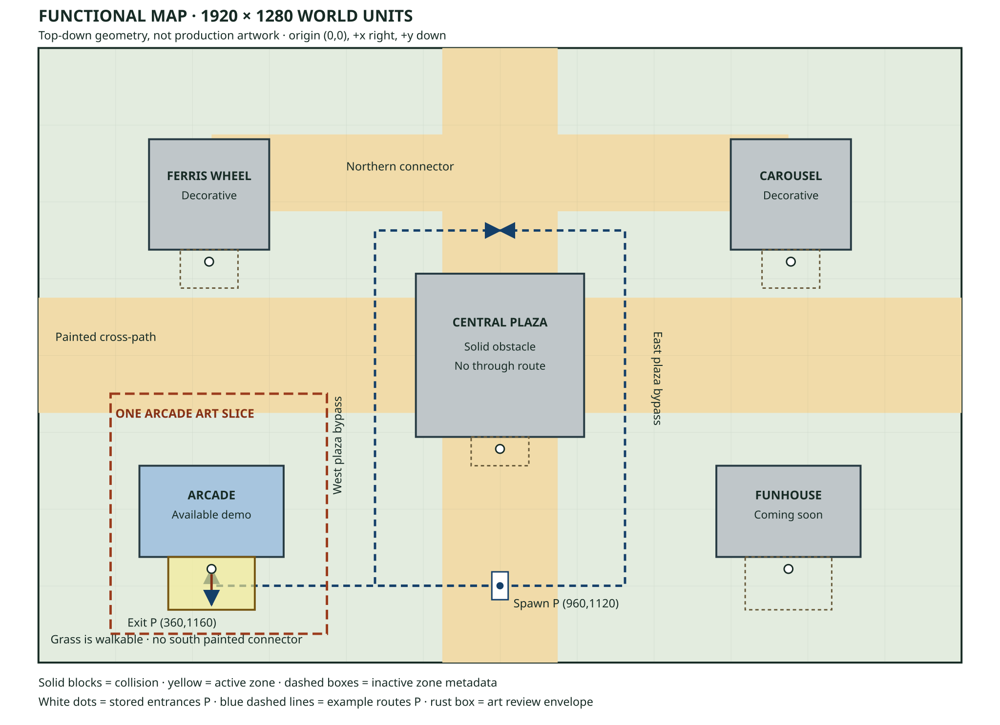

# Functional map: Phase 4 art baseline

This is a specification of the existing navigation plane, not a redesigned level.
Phase 4 art must fit these constraints. PR 1 changes no spawn, path, collision,
entrance, trigger, movement, or camera geometry. The diagram is an authoring aid,
not production artwork or a runtime background.



## Sources and coordinate convention

The authoritative data is in `src/world/map/fairground-map.ts`,
`src/world/attractions/attraction-registry.ts`, and
`src/world/player/player-geometry.ts`. Behavior comes from
`src/world/scenes/fairground-scene.ts`,
`src/world/rendering/attraction-render-plan.ts`, and
`src/catalog/validate-catalog.ts`.

Coordinates are world units on an axis-aligned 1,920 × 1,280 plane. Origin is the
top-left; +x goes right/east, +y goes down/south. A rectangle is `(x, y, width,
height)` with a top-left origin. Compass directions here describe this logical
plane, not an already implemented isometric projection. The scene currently
draws axis-aligned rectangles; near-isometric presentation remains art direction.

## Fixed geometry

Spawn is **(960, 1120)** in player visual-center coordinates. Its current body
center is **(960, 1136)**; see the anchor audit below.

| Painted path         | Rectangle             | Extent                       |
| -------------------- | --------------------- | ---------------------------- |
| North–south spine    | (840, 0, 240, 1280)   | x 840–1080, whole map height |
| East–west cross-path | (0, 520, 1920, 240)   | y 520–760, whole map width   |
| Northern connector   | (360, 180, 1200, 160) | x 360–1560, y 180–340        |

Paths are visual ground rectangles only: they do not restrict movement. Grass is
walkable. Attraction collision rectangles and the world bounds are the physical
constraints. There is no painted southern connector from spawn to the arcade or
Funhouse, no physical entrance gate, and no perimeter fence in the current map.

| Attraction / state         | Solid collision rectangle | Stored entrance | Interaction zone       | Sort anchor  |
| -------------------------- | ------------------------- | --------------- | ---------------------- | ------------ |
| Arcade / available         | (210, 870, 300, 190)      | (360, 1085)     | (270, 1060, 180, 110)  | (360, 1060)  |
| Ferris wheel / decorative  | (230, 190, 250, 230)      | (355, 445)      | (295, 420, 120, 80)    | (355, 420)   |
| Carousel / decorative      | (1440, 190, 250, 230)     | (1565, 445)     | (1505, 420, 120, 80)   | (1565, 420)  |
| Funhouse / coming soon     | (1410, 870, 300, 190)     | (1560, 1085)    | (1470, 1060, 180, 110) | (1560, 1060) |
| Central plaza / decorative | (785, 470, 350, 340)      | (960, 835)      | (900, 810, 120, 60)    | (960, 810)   |

Only the arcade can be selected, activated, located by teleport, or given an
interactive world marker. Other zones and entrances are metadata, not promises
of current demo access. Zipper is directory-only and has no map plot.

The central plaza is a **solid obstacle**, not a walkable square. It covers the
entire width of the north–south spine at y 470–810 and interrupts the east–west
cross-path at x 785–1135. The northern connector also overlaps the Ferris wheel
at x 360–480 and the carousel at x 1440–1560. Illustrations must not depict these
painted overlaps as usable passage through a structure.

## Routes and clearance

The following are clear waypoint examples, not implemented pathfinding or new
painted paths. Waypoints use the current player **visual center**, matching
spawn, scene movement reporting, teleport, and exit metadata. The full 20 × 18
body, including its vertical offset, clears the current obstacles along these
axis-aligned segments.

| Route                               | Visual-center waypoints                                         |
| ----------------------------------- | --------------------------------------------------------------- |
| Spawn to arcade approach            | (960,1120) → (360,1120) → (360,1085)                            |
| Arcade return animation             | (360,1085) → (360,1160), 450 ms; immediate under reduced motion |
| West bypass around plaza            | (960,1120) → (700,1120) → (700,380) → (960,380)                 |
| East bypass around plaza            | (960,1120) → (1220,1120) → (1220,380) → (960,380)               |
| Ferris wheel front from west bypass | (700,445) → (355,445)                                           |
| Carousel front from east bypass     | (1220,445) → (1565,445)                                         |
| Funhouse front from spawn           | (960,1120) → (1560,1120) → (1560,1085)                          |

The horizontal gap from the Ferris wheel's east edge x 480 to the
plaza's west edge x 785 is **305 units**. The corresponding east gap is also
305 units (1135–1440). Along y 520–760, both are part of larger open bypass
areas. The gap between upper attraction collision bottoms y 420 and plaza top
y 470 is 50 units, or 32 units of body-center travel after allowing the 18-unit
body height. It is passable geometry but a poor location for additional clutter
or a tall foreground silhouette. Preserve the generous outer bypasses.

## One production slice

Produce the **arcade only**, with a local ground/approach treatment and enough
player/state visuals to demonstrate the complete existing demo loop. Reserve
the authoring envelope **x 150–600, y 720–1220** (450 × 500) for this one-area
visual proof. This dashed envelope is a review/capture boundary, not a collision
shape, asset dimension, or new runtime map record. The spawn-to-arcade approach
continues across existing open ground outside the envelope.

Within the envelope retain the 300 × 190 solid footprint, the south-facing
entrance, the full trigger area, and the complete exit corridor. Any roof,
marquee, shadow, or decorative overhang is a visual layer, never a reason to
enlarge collision automatically. Keep the immediate entrance and southward
exit leg readable. Decorative props must not imply new obstacles on the route.
Leave all other attractions as placeholders; broader asset production and
expansion to additional attractions are outside this slice.

## Existing anchor mismatch: exact values

The player rectangle is 34 × 58 with centered origin. Its 20 × 18 body has
offset (7,36) relative to the visual top-left. For visual center `P`:

```text
visual top-left = (P.x - 17, P.y - 29)
body top-left   = (P.x - 10, P.y + 7)
body center G   = (P.x,      P.y + 16)
body bottom F   = P.y + 25
```

`PLAYER_GROUND_OFFSET_Y` is 16. Selection uses **G** (`body.center`); player
depth uses **F** (`body.bottom`). Spawn, teleport, exit tween endpoints,
position-change events, camera follow, and diagnostics use **P**. Validation
already converts authored player positions to G where appropriate. These are
three distinct anchors, not interchangeable meanings of “feet.”

For the arcade, stored entrance (360,1085) places G at **(360,1101)** and F at
**1110**. Stored exit destination (360,1160) places G at **(360,1176)** and F at
**1185**. The zone ends at y 1170, so the returned player is correctly **outside**
selection. Reinterpreting exit.to as a ground center without conversion would
leave G at y 1160, inside selection, and change behavior.

Attraction `position` currently means **visual top-left**, not ground anchor.
`createAttractionRenderPlan` adds half the placeholder dimensions to compute
its center. Collision happens to match visible placeholder bounds today but is
stored independently. The explicit attraction sort anchor is at its collision
bottom center; only the anchor's y coordinate affects depth. Labels use the
visual center and structure depth + 0.01. Interaction markers use depth 1281.

### Anchor recommendation

For the Phase 4 slice, retain authored position conventions and existing runtime
player coordinates. Add only the optional presentation metadata in item 2 when
the production renderer is implemented. Items 1, 3, and 4 are optional future
coordinate migrations, not requirements for this art slice or work in PR 1.

1. Keep the navigation plane Cartesian; select one named navigation anchor
   (prefer existing body center G) and document separate visual and sort anchors.
   Add tested `visualCenterToGround` / `groundToVisualCenter` adapters before
   switching any consumers. Preserve effective spawn G (960,1136), arcade
   entrance G (360,1101), exit G (360,1176), and the existing trigger boundaries.
2. Add optional presentation-anchor metadata alongside existing `position`,
   retaining top-left placeholder behavior when it is absent. Give each new
   visual an explicit local ground anchor and independent pixel bounds/scale.
   Place it by `drawTopLeft = worldAnchor - localAnchor * scale`. For the proposed
   320 × 310 arcade visual with bottom-center local anchor (160,310), world
   presentation anchor (360,1060), and scale 1, visible bounds are x 200–520,
   y 750–1060. Its collision stays x 210–510, y 870–1060. This artwork extends
   north of its base; do not redefine every attraction's existing `position`.
   Preserve the arcade's structure sort y 1060 independently from its roof
   height and from player G/F. Do not derive collision from opaque pixels,
   image dimensions, shadows, or the new image origin.
3. Migrate authored positions, runtime setters/tweens, validator conversion,
   selection, diagnostics, and position-event consumers together. Do not add
   the 16-unit offset twice. Keep camera behavior stable unless an explicit
   camera change is approved. Test old and new representations against the
   same effective body coordinates, especially the out-of-zone exit endpoint.
4. If a future real isometric projection is introduced, treat it as a separate
   rendering/input/camera conversion change with its inverse and regression
   tests. Do not rotate or compress collider data to match a concept picture.

## View, layering, and occlusion checks

- Maintain the logical south-facing arcade entrance. Generated facade depth
  must not suggest a different usable door or move the opening into collision.
- Current sorting is one structure rectangle and one label per attraction.
  A tall production roof/canopy may need separate layers to sort at the side
  edges. Review player-behind, both-side, and player-in-front views; one global
  bottom anchor is not proof of correct occlusion everywhere.
- Preserve readable selection and visited indications without relying on
  color alone. Keep essential attraction names and instructions in the DOM;
  raster sign lettering is decoration, not the access route.
- Keep shadows beneath actors and markers above scenery. Do not make a shadow
  look like an impassable region or hide the 20 × 18 contact footprint.
- Camera bounds are the map rectangle. The zoom lower bound is
  `max(viewportWidth / 1920, viewportHeight / 1280)`; default/return framing
  targets at least 1, with manual zoom allowing up to 4 (or the minimum if
  larger). A screenshot need not show the entire world. Check entrance/exit
  framing at desktop/tablet sizes and near world edges; do not expand bounds
  just to fit decorative roofs.
- Keep the plaza bypasses and grass approach legible in the concept. Do not
  add fences, crowds, stalls, or vegetation that reads as collision there.

## Constraints for the generated concept

The first generated concept is the local arcade slice: use its footprint,
south-facing entrance, open approach, and exit corridor as constraints. Show
fixed near-isometric art direction with one consistent camera/light/material
language. Do not require the local concept to depict the whole fairground.

For any later whole-fairground concept, use the diagram as a topology reference:
arcade lower-left, Ferris wheel upper-left, carousel upper-right, Funhouse
lower-right, and a solid central landmark. Preserve relative plot locations and
generous open approaches; avoid invented access through the plaza or northern
path overlaps. Keep the arcade as the focal production area, other plots
schematic.

The generated concept is an interpretation for composition and visual language,
**not a texture, collision mask, measured export, or replacement map**. Exact
coordinates in this document and the registries win over every generated
detail. New path segments, entrances, fences, or layout changes require a
separate navigation design decision and traversal tests.
